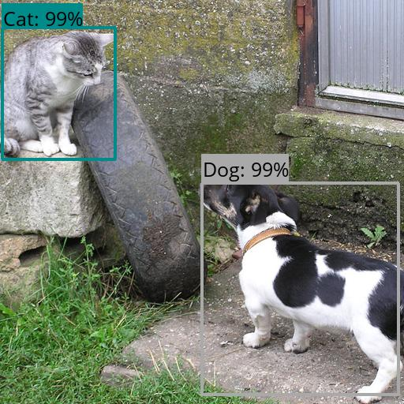
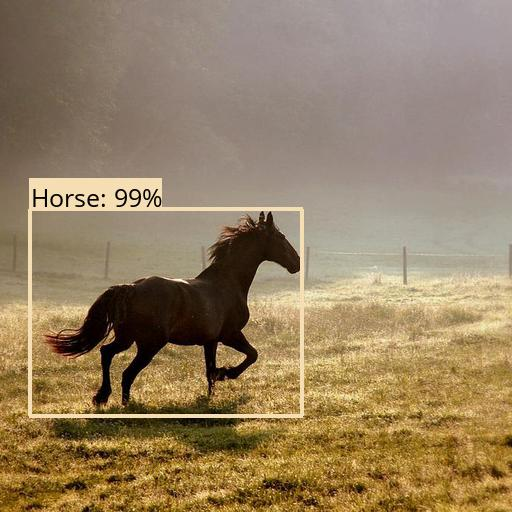
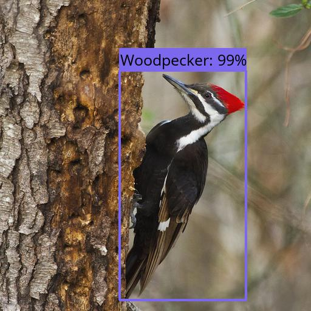

# objdetection-api

`objdetection-api` is a REST API built upon the FastAPI framework to provide object detection service based on [a pre-trained model](https://tfhub.dev/google/faster_rcnn/openimages_v4/inception_resnet_v2/1).
By default, it detects animals in an image and frames them in a bounding box.
An example is shown below:



*[Original image](https://commons.wikimedia.org/wiki/File:A_cat_and_a_dog_(216798062).jpg) from Wikimedia Commons*

## Quickstart

1. Install Docker and docker-compose.
1. Run `docker-compose up -d`.
1. The API is accessible from http://127.0.0.1:8080.

## API Reference

The API has a single endpoint to perform the prediction and obtain an image with the bounding boxes drawn.

### Perform Prediction

* **URL**

  `/predict`

* **Method:**
  
  `POST`

* **Data Params**

   | Parameter | Type | Description |
   |:----------|:-----|:------------|
   | `b64`          | `string`  | **Required**. The image on which the prediction should be performed encoded in base64. |
   | `resize_image` | `boolean` | Whether the image should be resized to a size of 512 x 512 pixels. Defaults to true. |
   | `min_score`    | `float`   | The score threshold below which the prediction is discarded, between 0 and 0.9 inclusive. For example, a `min_score` of 0.5 displays (captures in a bounding box) only the predictions with scores >=50%. Defaults to 0.2. |

* **Success Response:**
  
  * **Code:** 200 <br />
    **Content:**
    ```
    {
        "b64" : [The image with bounding boxes drawn encoded in base64],
        "inference_time" : [The inference time, e.g. 8.613611459732056]
    }
    ```
 
* **Error Response:**

  * **Code:** 400 BAD REQUEST <br />
    **Content:**
    ```
    { detail : "Payload is not base64-encoded." }
    ```
    
  OR

  * **Code:** 400 BAD REQUEST <br />
    **Content:**
    ```
    { detail : "Payload is not a valid image." }
    ```
    
  OR

  * **Code:** 400 BAD REQUEST <br />
    **Content:**
    ```
    { detail : "Minimum score should be between 0 and 0.9 inclusive." }
    ```

* **Sample Call:**

  ```
  let payload = JSON.stringify({
    "b64": b64,
    "resize_image": true,
    "min_score": 0.2
  });

  let data = await fetch("http://127.0.0.1:8080/predict", {
    method: "POST",
    headers: { "Content-Type": "application/json" },
    body: payload
  })
  .then(res => res.json())
  .then(data => data)
  .catch(e => console.log(e));
  ```

## GPU Support

Enabling the GPU for object detection greatly increases the inference time. See [Inference Time](#inference-time).

The following steps can be performed to enable GPU support.

1. Install Docker and docker-compose.
1. Install [nvidia-container-runtime](https://docs.docker.com/config/containers/resource_constraints/#gpu).
1. Run `docker-compose -f docker-compose.yml -f docker-compose.gpu.yml build`.
1. Run `docker-compose -f docker-compose.yml -f docker-compose.gpu.yml up -d`.
1. The API is accessible from http://127.0.0.1:8080.

## Customizing Classes to Detect

The file `app/data/valid_classes.json` can be modified to include custom classes for object detection.
These classes can be viewed from this [link](https://storage.googleapis.com/openimages/2018_04/class-descriptions-boxable.csv).

For instance, to detect plants (the `Plant` class) in any image, add the key-value pair `"/m/05s2s" : "Plant"` to the file.

## Inference Time

A comparison of the inference time (in seconds) with GPU versus without GPU is provided below.
All tests are done on an Intel Skylake processor with 4 vCPUs and an NVIDIA Tesla T4 GPU, and with the image resized.


**Inference Time:** \
1.31s  (with GPU) \
7.94s  (w/o GPU)

*[Original image](https://commons.wikimedia.org/wiki/File:A_cat_and_a_dog_(216798062).jpg) from Wikimedia Commons*

---



**Inference Time:** \
1.27s  (with GPU) \
8.06s  (w/o GPU)

*[Original image](https://commons.wikimedia.org/wiki/File:Running_horse_(5210454901).jpg) from Wikimedia Commons*

--



**Inference Time:** \
1.29s  (with GPU) \
8.08s  (w/o GPU)

*[Original image](https://commons.wikimedia.org/wiki/File:Pileated_Woodpecker_(9597212081).jpg) from Wikimedia Commons*
